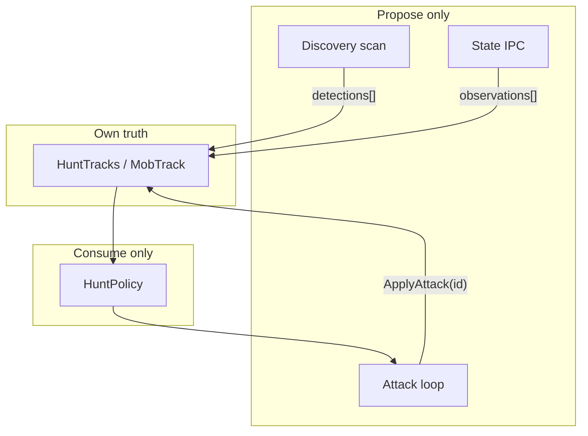
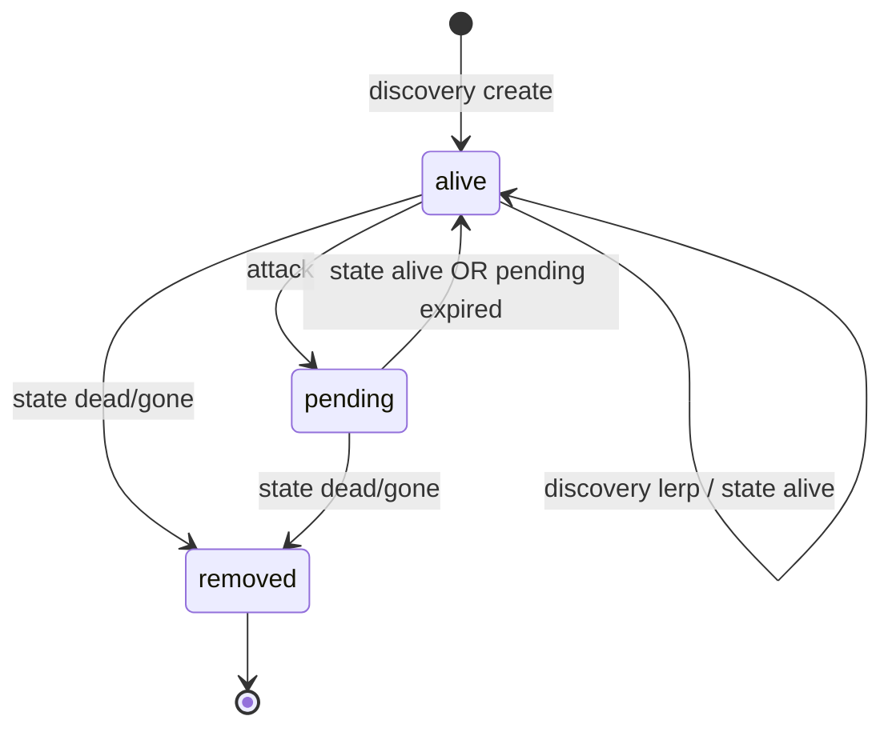

# Hunt Architecture — MobTrack Model

## Central concept

**MobTrack** is the single source of truth for one tracked mob instance.  
Only `HuntTracks.ahk` owns MobTracks. Every other layer **proposes events**; HuntTracks applies them.

## Layers

| Layer | Module | Interval | IPC | Proposes |
|-------|--------|----------|-----|----------|
| **Discovery** | `MobRecognition.ahk` | 1000ms | `scan` | living detections |
| **State** | `MobStateRecognition.ahk` | 150ms + post-attack | `state` | observations per track id |
| **Attack** | `BotLogic.ahk` | ~25ms | none | attack event |
| **MobTrack store** | `HuntTracks.ahk` | — | — | applies all events |
| **Policy** | `HuntPolicy.ahk` | — | — | picks attackable id |

## MobTrack fields

| Field | Set by |
|-------|--------|
| `id` | create |
| `mobName` | create |
| `x`, `y` | create; discovery lerp; state alive (authoritative) |
| `confidence` | create; discovery; state alive |
| `attackCount` | attack |
| `lastDiscoveryTick` | discovery |
| `lastStateTick` | state |
| `lastAttackTick` | attack |
| `pendingResultUntilTick` | attack |
| `state` | `alive` / `pending` / removed on `dead`/`gone` |
| `areaEpoch` | create (current `HUNT_AREA_EPOCH`) |

## Event receivers (HuntTracks)

| Event | Function |
|-------|----------|
| Discovery batch | `HuntTracks_ReceiveDiscoveryDetections` → `MobTrack_ApplyDiscoveryDetection` |
| State batch | `HuntTracks_ReceiveStateObservations` → `MobTrack_ApplyStateObservation` |
| Attack | `MobTrack_ApplyAttack` |

Legacy aliases: `HuntTracks_ApplyDetections`, `HuntTracks_ApplyStateUpdates`, `HuntTracks_ApplyAttackEvent`.

## MobTrack lifecycle

## Coordinate ownership

| Source | Rule |
|--------|------|
| **Discovery** | Lerp correction: `lerp(track, detection, HUNT_DISCOVERY_LERP_ALPHA)` on match |
| **State alive** | Authoritative replace of `x`, `y`, `confidence` |
| **Attack** | Read only — never IPC, never writes position |

## Module responsibilities

### Discovery (`MobRecognition` + `HuntDiscoveryTick`)
- Run `scan` IPC
- Parse candidates, filter player ignore
- Call `HuntTracks_ApplyDetections`
- Does **not** own tracks, lifecycle, attackability, or death decisions

### State (`MobStateRecognition` + timers)
- Run `state` / direct IPC
- Parse `trackUpdates` → `HuntTracks_ReceiveStateObservations`
- Does **not** create tracks or mutate attack state

### Attack (`HuntAttackTrack`)
- Read latest MobTrack by id
- `MobTrack_IsAttackable` (via policy selection)
- `MoveMouseTo` + skill click
- `MobTrack_ApplyAttack` + queue post-attack direct state
- **No vision IPC**

### HuntPolicy
- `HuntPolicy_SelectTarget` using `MobTrack_IsAttackable`
- `HuntPolicy_ShouldTeleport` — requires `huntScansSinceAreaReset >= 1` (fresh discovery on this area), zero tracks, zero scan living

### HuntTracks
- All MobTrack storage and lifecycle
- `MobTrack_IsAlive`, `MobTrack_IsPending`, `MobTrack_IsExpired`, `MobTrack_IsAttackable`

## Timers & IPC slot

- `huntServerBusy` — one Python IPC at a time (discovery / periodic state / direct state)
- Attack never waits on `huntServerBusy`

## Logging prefixes

| Prefix | Source |
|--------|--------|
| `[DISCOVERY]` | discovery skip/fail |
| `[STATE]` | state observations |
| `[TRACK]` | MobTrack create/remove/state |
| `[HUNT]` | attack, target, teleport |
| `[DIRECT]` | post-attack direct queue |

## Python (unchanged)

- `scan` — discovery (`_evaluate_discovery_center`)
- `state` — track observations (`evaluate_track_states` / `evaluate_track_state_direct`)

## AHK timing constants

| Constant | Value |
|----------|-------|
| `HUNT_STATE_INTERVAL_MS` | 150 |
| `HUNT_DISCOVERY_INTERVAL_MS` | 1000 |
| `HUNT_POST_ATTACK_STATE_DELAY_MS` | 120 |
| `HUNT_TRACK_MATCH_RADIUS` | 45 |
| `HUNT_ATTACK_RESULT_WINDOW_MS` | 1800 |
| `HUNT_DISCOVERY_LERP_ALPHA` | 0.35 |
| `HUNT_NEW_TRACK_STATE_GRACE_MS` | 1000 — state cannot remove never-attacked tracks as dead/gone |
