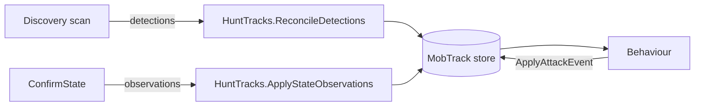

# Hunt Architecture — Layered MobTrack Model

## Layers

| Layer | Python Module | Responsibility |
|-------|--------|----------------|
| **Discovery** | `workers/discovery_worker.py` + `vision/discovery_filter.py` | Scan → candidate detections. Match/create/miss via `HuntTracks.reconcile_detections`. **Does not refresh coords on existing tracks.** |
| **Tracking** | `hunt_tracks.py` | Sole `MobTrack` owner. `ReconcileDetections`, `ApplyStateObservations`, `ApplyAttackEvent`. |
| **State** | `workers/confirm_state_worker.py` | Classify tracked mobs → observations with **fresh screen x/y**. No track mutation. |
| **Orchestration** | `hunt_runtime.py` | Thread spawning, control loop, wires Discovery → Tracking → State → Policy → Attack |
| **Policy** | `hunt_policy.py` | Round-robin target selection among attackable tracks. Reads `HuntTracks` only. |

## Data flow



## Orchestration (hunt_runtime.py)

```
; Discovery tick
scan := ctx.detector.discover(roi)
filtered := filter_scan_candidates(scan.detections, roi, cell_size)
ctx.tracks.reconcile_detections(detections, ...)

; State tick
requests := ctx.tracks.collect_local_track_requests(...)
batch := ctx.detector.track_locals(roi, snapshots)
ctx.tracks.apply_local_track_observations(observations, ...)

; Post-attack direct state
ctx.urgent.schedule_direct(...)
batch := ctx.detector.state_direct(roi, snapshot)
ctx.tracks.apply_state_observations(mapped, ...)
```

## Coordinate ownership

| Source | Rule |
|--------|------|
| **Discovery reconcile — match** | Identity only (`lastDiscoveryTick`, `discoveryMissCount`). **No x/y update.** |
| **Discovery reconcile — create** | Seed initial `x,y,confidence,discoveryScale` for new track. |
| **State tick (all alive/pending tracks)** | Drift-search from last known point; **authoritative combat x/y** on `alive`. |
| **State dead/gone (attackCount=0)** | Ignored — track kept; counters only. |
| **State alive observation** | Updates x/y + confidence + `updatedTick`. |
| **Attack / HuntMode** | Read `HuntTracks` only — no vision IPC. Skill delay and rotation cursor live in `hunt_policy` / `hunt_runtime`. |

## HuntTracks public API

| Method | Purpose |
|----------|---------|
| `reconcile_detections(detections, ...)` | Match/create/miss/remove from discovery candidates |
| `apply_state_observations(observations, ...)` | Apply state classifier output |
| `apply_attack_event(track_id, ...)` | Record attack / pending window |
| Query | `get_track_count`, `get_alive_or_pending_count`, `get_attackable_count`, `has_known_targets`, `has_attackable_tracks`, `get_area_clear_candidate`, `get_track_by_id` |
| Mutation | `reconcile_detections`, `apply_state_observations`, `apply_attack_event`, `area_reset` |

## State/Confirm public API

| Method | Returns |
|----------|---------|
| `detector.state_confirm(roi, snapshot)` | Observations with alive/dead/gone state |
| `detector.state_direct(roi, snapshot)` | Same for single post-attack check |

**ConfirmStateWorker must not call hunt_tracks mutation methods directly** (uses `ctx.tracks.apply_state_observations`).

## Discovery public API

| Method | Returns |
|----------|---------|
| `detector.discover(roi)` | Scan result with candidates |
| `filter_scan_candidates(filtered, roi, cell_size)` | Player-ignore + living target candidate filter (spatial) |

**DiscoveryWorker must not call hunt_tracks or hunt_mode mutation directly** (uses `ctx.tracks.reconcile_detections`).

## Timers

| Timer | Interval | Role |
|-------|----------|------|
| `state_interval_ms` | Configurable (default 100ms) | Canonical state / local track tick |
| `discovery_interval_ms` | Configurable (default 3000ms) + post-teleport | New mob candidates |
| Hunt loop | ~25ms | Target select + attack |

## Behaviour / teleport

Teleport when:
- `hunt_mode.discovery_since_reset` (one scan completed this area)
- `ctx.tracks.get_area_clear_candidate().clear` (zero alive/pending tracks)
- `can_consider_area_clear()` (not vision busy, no pending direct state)

## Validation logs

Prefix `[VAL]` — enable/disable via `config.validation_enabled`.

| Event | When |
|-------|------|
| `area_reset` | After `area_reset` |
| `discovery_scan` | After reconcile in discovery tick |
| `state_obs` | Each state observation |
| `attack_decision` / `attack_engage` | Target select / click |
| `track_removed` | dead/gone/discovery_miss removal |
| `no_target` | Each `on_no_attackable_targets` outcome |
