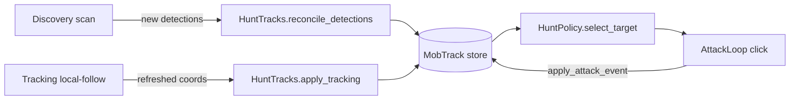

# Hunt Architecture — Discovery / Tracking / Attack

Single track state (`alive`). Discovery creates tracks for new mobs, tracking
keeps their coordinates fresh and expires lost ones, attack rotates through them.

## Layers

| Layer | Python Module | Responsibility |
|-------|--------|----------------|
| **Discovery** | `workers/discovery_worker.py` + `detection/discovery_filter.py` | Scan → candidate detections → create tracks for **new** mobs only via `HuntTracks.reconcile_detections`. Dedups against a frame-time position snapshot. **Never moves or removes existing tracks.** |
| **Tracking** | `workers/tracking_worker.py` + `hunt_tracks.py` | Local-follow each alive track (`DetectorSession.track_locals_frame`), refresh coords/confidence via `HuntTracks.apply_tracking`, and expire tracks past `HUNT_TRACK_LOST_LIMIT` misses. |
| **Attack** | `workers/attack_loop.py` | Select a target (`HuntPolicy`) and click it. Reads coords through `HuntTracks.snapshot_for_track` (copied under lock). |
| **Hunt mode** | `hunt_mode.py` + `hunt_mode_strategies.py` | Teleport (when area clear) / walk (wait) strategies for the no-target case. |
| **Orchestration** | `hunt_runtime.py` | Spawns worker threads and wires the shared `HuntRuntimeContext`. |
| **Policy** | `hunt_policy.py` | Round-robin target selection among alive tracks. Reads `HuntTracks` only. |

## Concurrency

Discovery and tracking run on separate threads, each with its **own**
`DetectorSession` (`ctx.detector` for discovery, `ctx.tracker` for tracking) so
their detector locks never contend. `HuntTracks` is the single shared, lock-guarded
`MobTrack` store.

## Data flow

## Coordinate ownership

| Source | Rule |
|--------|------|
| **Discovery reconcile — new** | Seed `x,y,confidence,discoveryScale` for a brand-new track. |
| **Discovery reconcile — existing** | Skipped (dedup against frame-time snapshot). **No x/y update.** |
| **Tracking** | Authoritative coord refresh every tick; increments `lost_count` on miss and removes the track once `lost_count >= HUNT_TRACK_LOST_LIMIT`. |
| **Attack** | Reads a coord snapshot copied under the store lock — never a live reference. |

## HuntTracks public API

| Method | Purpose |
|----------|---------|
| `reconcile_detections(detections, existing_positions=…)` | Create tracks for new mobs (create-only) |
| `apply_tracking(results, …)` | Apply local-follow results; returns removed track ids |
| `apply_attack_event(track_id, …)` | Record an attack |
| Query | `get_track_count`, `get_alive_count`, `has_alive_tracks`, `get_area_clear_candidate`, `get_track_by_id`, `snapshot_for_track`, `snapshot_alive`, `positions_snapshot` |

## Timers

| Timer | Interval | Role |
|-------|----------|------|
| Tracking | `TRACK_INTERVAL_S` (50ms / 20 Hz) | Local-follow + expiry |
| `discovery_interval_ms` | Configurable (default 3000ms) + post-teleport wake | New mob candidates |
| Attack loop | ~`HUNT_ATTACK_INTERVAL_MS`-paced | Target select + click |

## Teleport (TeleportStrategy)

Teleport when all of:
- `hunt_mode.discovery_since_reset` (at least one scan completed this area)
- `HuntTracks.get_area_clear_candidate().clear` (zero alive tracks)
- a teleport key is configured

## Validation logs

Prefix `[VAL]` — enable/disable via `config.validation_enabled`.

| Event | When |
|-------|------|
| `area_reset` | After `area_reset` |
| `discovery_scan` | After reconcile in a discovery tick |
| `no_target` | Each `on_no_attackable_targets` outcome |
